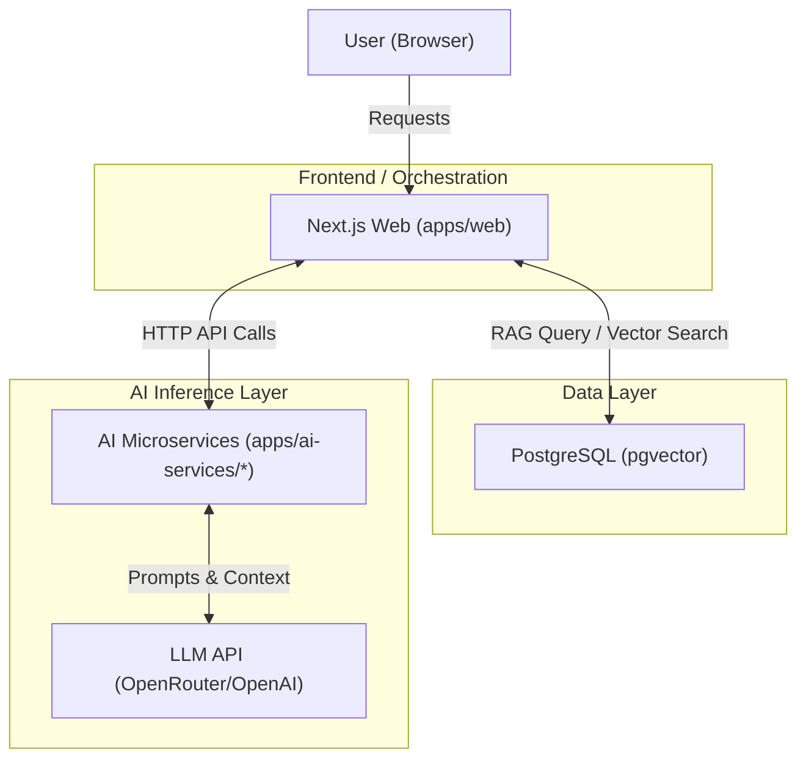

# SkillBridge

SkillBridge is an AI-powered skill intelligence and learning platform. It gives government officials and professionals a way to assess their competencies, identify skill gaps, and receive personalized learning recommendations — powered by retrieval-augmented generation (RAG) and vector search.

Repo: [github.com/keshu-bara/skillbridge](https://github.com/keshu-bara/skillbridge)

## Overview

SkillBridge is a monorepo split into two primary domains:

- **Web Application (`apps/web/`)** — A Next.js application that serves as the primary user interface. It handles authentication, data persistence via PostgreSQL, and RAG orchestration, coordinating application state and communication with the AI backend.
- **AI Microservices (`apps/ai-services/`)** — A collection of dedicated FastAPI services (`assessment-engine`, `competency-engine`, `recommendation-engine`, `remediation-engine`) that handle intelligence tasks such as analysis, quiz generation, and course ranking using LLMs.

The platform relies on **vector search** (`pgvector`) to semantically match course materials and competency frameworks against user profiles, enabling true skill matching rather than simple keyword search.

## Architecture



The Next.js frontend acts as the primary orchestrator, while independent Python-based services handle specialized AI workflows.

### Component Breakdown

**1. Next.js Web (`apps/web/`)**
- **Data Persistence** — Uses `apps/web/prisma/schema.prisma` to model users, courses, and assessments in PostgreSQL.
- **RAG Operations** — Uses `apps/web/lib/retrieval.ts` and `apps/web/lib/embeddings.ts` to perform vector similarity search against the `Course` and `DocumentChunk` models.
- **Orchestration** — Acts as the API client for the AI engines, passing retrieved context (e.g., document chunks) to them for processing.

**2. AI Engines (`apps/ai-services/`)**
- Stateless FastAPI applications (e.g., `apps/ai-services/assessment-engine/main.py`).
- Accept structured JSON payloads containing text extracts or RAG-retrieved chunks.
- Use a shared utility library, `apps/ai-services/_shared/llm.py`, to communicate with external LLM providers (OpenRouter or OpenAI) through a standardized interface.

## Repository Structure

```shell
Ishant234/skillbridge/
├── apps/
│   ├── ai-services/
│   │   ├── _shared/
│   │   │   └── llm.py
│   │   ├── assessment-engine/
│   │   │   ├── main.py
│   │   │   └── requirements.txt
│   │   ├── competency-engine/
│   │   │   ├── main.py
│   │   │   └── requirements.txt
│   │   ├── recommendation-engine/
│   │   │   ├── main.py
│   │   │   └── requirements.txt
│   │   └── remediation-engine/
│   │       ├── main.py
│   │       └── requirements.txt
│   └── web/
│       ├── app/
│       │   ├── api/
│       │   ├── dashboard/
│       │   └── layout.tsx
│       ├── components/
│       ├── lib/
│       │   ├── auth.ts
│       │   ├── embeddings.ts
│       │   ├── prisma.ts
│       │   └── retrieval.ts
│       ├── prisma/
│       │   └── schema.prisma
│       ├── next.config.ts
│       └── package.json
└── .gitignore
```

## Tech Stack

| Layer | Technologies |
|---|---|
| Web Frontend | Next.js (App Router), React 19, TypeScript, Tailwind CSS, next-auth |
| Database | PostgreSQL with `pgvector`, managed via Prisma ORM |
| AI Backend | Python 3, FastAPI, Pydantic |
| LLM Integration | OpenAI-compatible clients (`apps/ai-services/_shared/llm.py`) via OpenRouter or OpenAI |

## Key Features

- **Vector Search & RAG** — A complete RAG pipeline. Course materials and competency frameworks are chunked and embedded via `apps/web/lib/embeddings.ts` (Gemini embeddings), stored in `DocumentChunk`, and queried using raw SQL via `apps/web/lib/retrieval.ts` (Prisma does not natively support vector operators).
- **Engine Decoupling** — Intelligence logic is separated into distinct engines. For example, `apps/ai-services/assessment-engine/main.py` focuses purely on generating MCQs and study notes, keeping the web backend lean.
- **Resilient Fallbacks** — AI services remain functional even if LLM calls fail or return invalid JSON, via mechanisms like `fallback_mcqs` (assessment-engine) and `heuristic_rank` (recommendation-engine).
- **Dynamic Role-Based Access** — `apps/web/lib/auth.ts` refreshes user roles directly from the database rather than relying solely on JWT claims, so admin/trainer promotions take effect immediately.

## Setup

### Prerequisites
- Node.js and a package manager (npm/pnpm/yarn) for `apps/web`
- Python 3 for each service in `apps/ai-services`
- PostgreSQL instance with the `vector` extension enabled (required for the `Unsupported("vector(768)")` types in `apps/web/prisma/schema.prisma`)
- API keys for an LLM provider (OpenRouter or OpenAI)

### Environment Variables
Every engine in `apps/ai-services/` includes a `.env.example` file. Copy it and configure it with valid LLM API keys to enable the intelligent features.

### Web App
```bash
cd apps/web
npm install
npm run dev
```
`npm install` triggers a `postinstall` script that runs `prisma generate`. If you modify `apps/web/prisma/schema.prisma`, re-run `prisma generate` to update the client.

### AI Services
Each engine is an independent FastAPI service:
```bash
cd apps/ai-services/<engine-name>
pip install -r requirements.txt
uvicorn main:app --reload
```

## License

Refer to the repository for license details.
